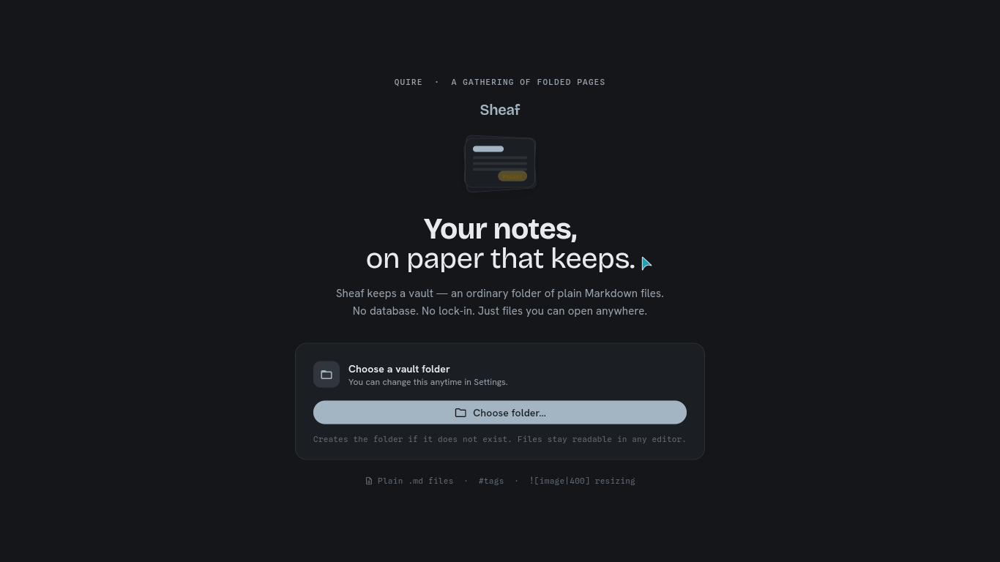
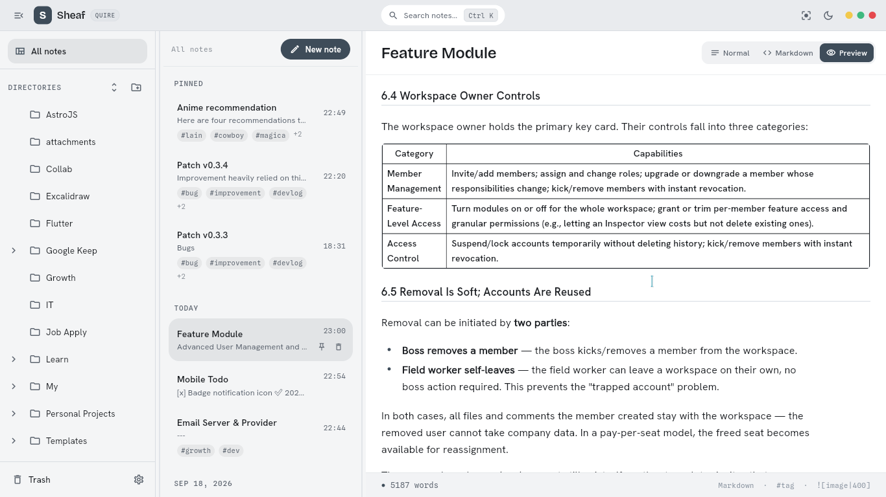
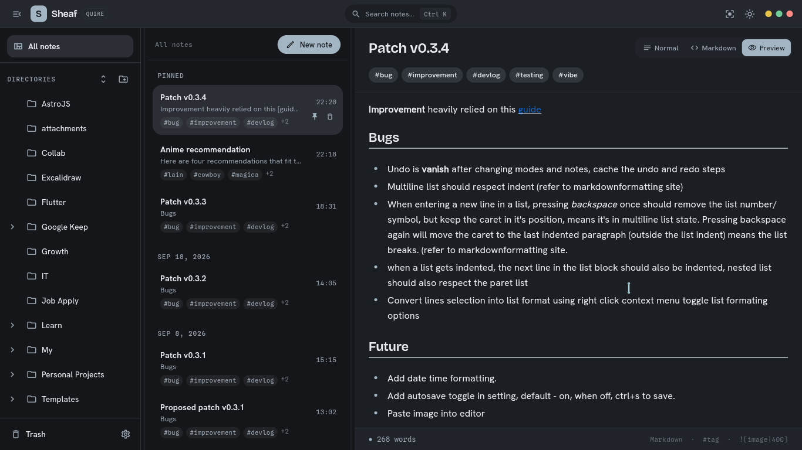
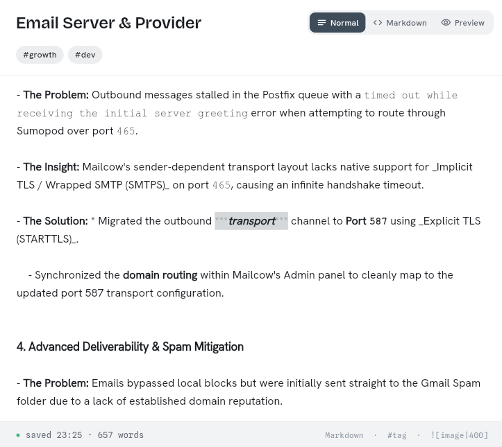
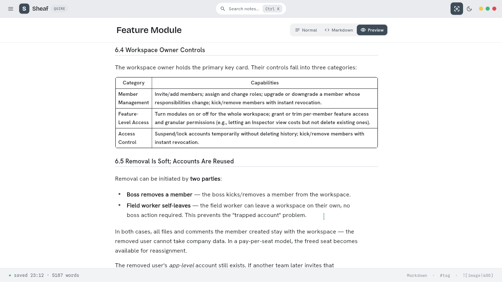
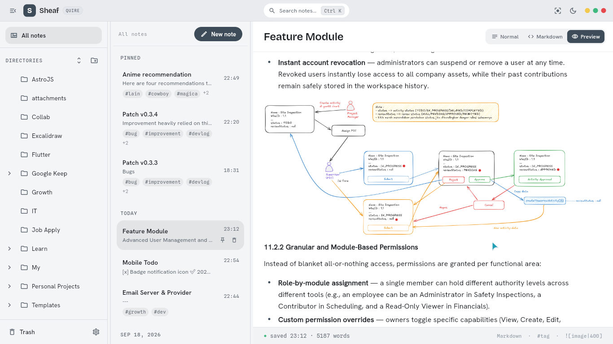
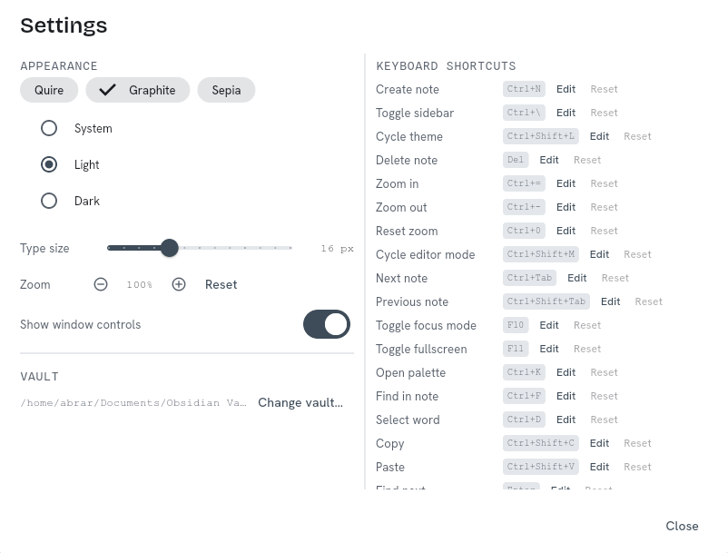

# Sheaf
[](https://github.com/AbrarAbe/sheaf/actions/workflows/release.yml)

A local-first Markdown notes desk for the Linux desktop. Your vaults are just
folders of plain `.md` files — no database, no lock-in. Add multiple vault
directories in Settings; notes merge newest-first. Built with Flutter + GTK,
shipped as a self-contained tarball.


</br>

<table align="center"
    <tr>
        <td align="center" width=400>Ligth Mode !</td>
        <td align="center" width=400>Dark Mode !</td>
    </tr>
    <tr>
        <td></td>
        <td></td>
    </tr>
</table>

## Features

<table align="right"
    <tr>
        <td align="center" width=400>Format Ready !</td>
    </tr>
    <tr>
        <td></td>
    </tr>
</table>

- **Multi-vaults** — add multiple vault folders in Settings; notes merge newest-first, scoped by `vaultIndex`/`folderPath`. Each vault keeps its own `.trash/`, `.attachments/`, and `.sheaf/meta.json` pins.
- **Plain-file vaults** — notes are standard Markdown you can open anywhere. Folder create/rename/delete included; dot-directories are left alone.
- **Three-pane shell** — sidebar · note list · editor, adapting across wide
  (≥1120 px), compact (720–1119 px), and stacked (<720 px) layouts. The
  sidebar is user-owned in every tier (toggle button or `Ctrl+\`), persists
  per tier, and becomes an overlay drawer when stacked. Draggable dividers
  with sane clamps.
- **Fast retrieval** — pinned notes float in a PINNED section; the rest is
  day-grouped, recent-first, with instant filtering across title + body and
  title-priority ranking.
- **Three editor modes** — Normal renders formatting live with markers hidden
  until touched; Markdown shows raw monospace source; Preview renders the GFM
  subset read-only. Autosave (~1 s) behaves identically everywhere.
- **Keyboard-complete editing** — `Ctrl+B/I/U` toggle bold/italic/underline (combinable, nesting `***`/`**<u>`; word-aware Unicode `café naïve` at bare caret), Enter continues lists (`- `, `* `, `1. `, `- [ ] `), `Tab`/`Shift+Tab` indent/outdent the current line or selection by four spaces, `Ctrl+F` finds inside the note (recomputes on edit), `Ctrl+D` selects word, `Ctrl+Shift+C/V` copy/paste, `Ctrl+Tab` cycles notes.
- **Type-first editing** — opening a note (list or `Ctrl+K`) drops the caret straight into the body; the title saves on blur (click away, `Tab`, or switching notes) without pressing Enter; the caret and scroll are remembered per note across switches. The preview never turns indented prose into a code block — indentation only nests lists, so use fenced code blocks for code. A note's title is always its file name; a `# Heading` in the body never overrides it.
- **Sticky state** — undo/redo history is kept per note, so `Ctrl+Z` still works after switching notes or cycling Normal/Markdown/Preview. The preview remembers its scroll position across mode switches, with a go-to-top button that fades in once you scroll down. Each mode keeps its own scroll controller, so switching modes no longer flashes the top of the note before landing on the cached position.
- **Nested folders** — folder tree renders recursively with chevron expand/collapse; indent per depth; collapsed state hides subtree without selecting.
- **Sticky DIRECTORIES header** — FOLDERS header (DIRECTORIES on Linux) stays pinned above the scrollable folder list.
- **In-editor tags** — `#tag` chips live inside the editor column under the title, scroll with content; in edit modes a tap copies `#tag ` at caret, and in Preview a tap scrolls the rendered preview to that tag.
- **Tight selection & scrollbar** — multi-line selection hugs glyphs (`BoxWidthStyle.tight`); interactive scrollbar shows hand cursor and padded gutter (`right 18/24`) without covering text.

<table align="right"
    <tr>
        <td align="center" width=450>Live Preview !</td>
    </tr>
    <tr>
        <td></td>
    </tr>
</table>

- **Live preview** — GFM subset (headings, emphasis, lists, task lists,
  quotes, fenced code, links, tables, `<u>` underline) rendered with your
  chosen theme world; links use the theme accent; `Ctrl+F` finds inside the
  rendered preview and `Enter`/`Shift+Enter` step through matches; System
  mode follows your desktop.
- **Theme worlds & type controls** — Quire, Graphite, and Sepia color sets ×
  System/Light/Dark; app-wide zoom (`Ctrl+=/-/0`); editor type size 12–24 px.
- **Quick-switcher** — `Ctrl+K` (or the header search pill) jumps to any note across vaults; an empty query lists notes newest-first, so the first row is always what you touched last.
- **Custom shortcuts** — remap non-formatting shortcuts in Settings (Keyboard Shortcuts); `Ctrl+B/I/U` stay reserved for formatting.
- **Focus & fullscreen** — `F10` collapses to an editor-only surface;
  `F11` true native fullscreen; optional traffic-light window controls in
  the header (hideable in settings).

<table align="right"
    <tr>
        <td align="center" width=450>Image Support !</td>
    </tr>
    <tr>
        <td></td>
    </tr>
</table>

- **Images** — drag & drop images into `<vault>/.attachments/` and reference
  them relatively, with Obsidian-compatible width syntax:
  ``. Existing `attachments/` folders are
  migrated to `.attachments/` on first vault open. The insert-image picker
  button is **deferred** (round 6) until the file-chooser flow is ready.
- **Trash** — deletions ask first (note, folder, and delete-forever each show a confirmation dialog; folder delete warns the whole tree moves), then land in `.trash/`; restore returns notes to their original folder with a toast, or delete forever; each entry shows when it was trashed.
- **Note info** — the note context menu has an Info entry showing file name, full path, created/modified dates, and word/character counts.
- **Auto-refresh** — external changes to the vault appear live via a file
  watcher.

## Keyboard shortcuts

| Action | Keys |
|---|---|
| New note | `Ctrl+N` |
| Move selection | `↑` / `↓` |
| Open selected | `Enter` |
| Delete selected | `Del` (confirm dialog, corner toast with Undo) |
| Find/filter list | `Ctrl+F`, dismiss with `Esc` |
| Show/hide sidebar | `Ctrl+\` |
| Cycle theme mode | `Ctrl+Shift+L` |
| Next/previous note | `Ctrl+Tab` / `Ctrl+Shift+Tab` |
| Bold / italic / underline | `Ctrl+B` / `Ctrl+I` / `Ctrl+U` |
| Select word | `Ctrl+D` |
| Find in note | `Ctrl+F` in the editor or preview, `Esc` closes |
| Copy/paste (terminal-style) | `Ctrl+Shift+C` / `Ctrl+Shift+V` |
| Undo / redo | `Ctrl+Z` / `Ctrl+Shift+Z` |
| Cycle editor mode | `Ctrl+Shift+M` |
| Indent / outdent line(s) | `Tab` / `Shift+Tab` |
| Zoom | `Ctrl+=` / `Ctrl+-`, reset `Ctrl+0` |
| Focus mode | `F10` |
| Fullscreen | `F11` |

>Shortcuts can be customized in the settings panel
<table>
    <tr>
        <td></td>
    </tr>
    <tr>
        <td align="center" width=450>More Customizations Coming Soon !</td>
    </tr>
</table>

## Install (Linux x64)

Requires `curl` and `grep` (preinstalled on virtually every desktop distribution).
The commands below always fetch the latest release — no version to type.
The app folder lives in `~/.local/share/sheaf`, the binary is linked into
`~/.local/bin` (keep the `sheaf/` folder intact, `lib/` and `data/` must stay
beside the binary):

```
URL=$(curl -fsSL https://api.github.com/repos/AbrarAbe/sheaf/releases/latest | grep -o '"browser_download_url": *"[^"]*linux-x64.tar.gz[^"]*"' | head -n1 | cut -d'"' -f4)
curl -LO "$URL"
mkdir -p ~/.local/share ~/.local/bin
tar xzf "${URL##*/}" -C ~/.local/share
ln -sf ~/.local/share/sheaf/sheaf ~/.local/bin/sheaf
sheaf
```

AppImage alternative (portable, no install):

```
URL=$(curl -fsSL https://api.github.com/repos/AbrarAbe/sheaf/releases/latest | grep -o '"browser_download_url": *"[^"]*AppImage[^"]*"' | head -n1 | cut -d'"' -f4)
curl -LO "$URL"
chmod +x "${URL##*/}"
"./${URL##*/}"
```

GTK 3 is the only runtime expectation, and it ships with virtually every
desktop distribution. To pin a specific version, replace `releases/latest`
with `releases/tags/vX.Y.Z` in the API URL above, or pick a file from
[Releases](https://github.com/AbrarAbe/sheaf/releases).

## Build from source

Prerequisites: a Flutter SDK on the **beta** channel (see the `sdk:` constraint
in `pubspec.yaml`), plus the standard Linux desktop build tools:

```
sudo apt-get install clang cmake ninja-build pkg-config libgtk-3-dev liblzma-dev
```

```
flutter pub get
flutter run -d linux            # development
flutter build linux --release   # produces build/linux/x64/release/bundle
```

## Project docs

- [`docs/spec.md`](docs/spec.md) — what Sheaf is (living spec)
- [`docs/design/`](docs/design) — design docs (theming, layout, voice)
- [`docs/adr/`](docs/adr) — architecture decision records
- [`docs/plan/plan_v0.1.md`](docs/plan/plan_v0.1.md) — v0.1 implementation plan
- [`docs/plan/plan_v0.2.md`](docs/plan/plan_v0.2.md) — v0.2 implementation plan (editor, modes, pinning, appearance)
- [`docs/plan/plan_v0.3.md`](docs/plan/plan_v0.3.md) — v0.3 implementation plan (polish & multi-directory)
- [`docs/plan/plan_v0.3.1.md`](docs/plan/plan_v0.3.1.md) — v0.3.1 implementation plan (paper cuts)
- [`docs/plan/plan_v0.3.2.md`](docs/plan/plan_v0.3.2.md) — v0.3.2 implementation plan (no surprises)
- [`docs/plan/plan_v0.3.3.md`](docs/plan/plan_v0.3.3.md) — v0.3.3 implementation plan (type-first)
- [`docs/plan/plan_v0.3.4.md`](docs/plan/plan_v0.3.4.md) — v0.3.4 implementation plan (sticky state)
- [`docs/plan/plan_v0.3.5.md`](docs/plan/plan_v0.3.5.md) — v0.3.5 implementation plan (steady)
