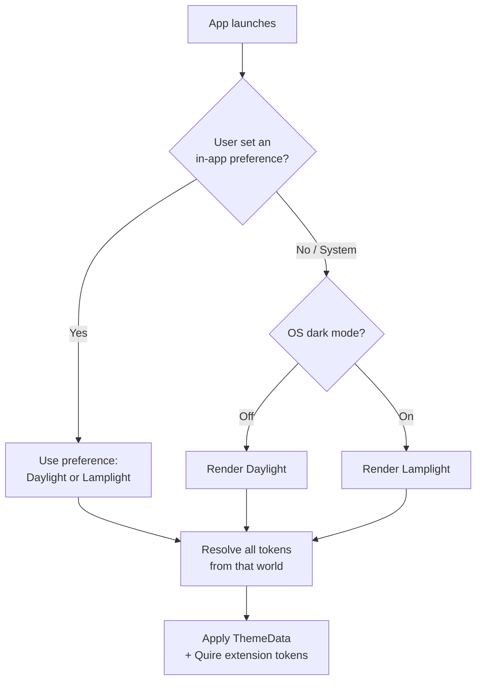

# Theming — Daylight, Lamplight & System

Sheaf ships **two color worlds** and **three selection modes**. The worlds are
Daylight (light) and Lamplight (dark) — see [color.md](color.md) for every token.
The modes decide which world renders.

## The three variants

### 1. Daylight (light)
Cool gray-paper neutrals, ink `#2F4BD7`. The default first-run experience.

### 2. Lamplight (dark)
Warm charcoal neutrals, ink brightened to `#93A8F0`, warm paper-white text.
**Not** a gray photocopy of Daylight — surfaces shift hue toward amber-brown,
and `accent.onInk` inverts to dark-on-light-blue for contrast correctness.

### 3. System (default)
Follows the OS brightness setting, switching instantly (no transition animation)
whenever the platform changes theme — including scheduled/Bedtime-mode switches
mid-session. This matches the existing app wiring (`themeMode: ThemeMode.system`).
On Linux, System follows the desktop's color-scheme preference (GNOME/KDE expose it
through the settings portal, which Flutter honors); wallpaper-derived Material You
palettes exist only on Android — on Linux, the Quire brand tokens *are* the everyday look.

## Selection model



Rules:

- In-app choices persist locally and override the OS until the user picks "System" again.
- The settings control is three-way radio: **System · Light · Dark**, labeled with
  those plain words (user-facing copy says Light/Dark/System; "Daylight/Lamplight"
  are internal names).
- Theme switches never animate — the world changes as instantly as walking into
  another room.
- Widgets, quick tiles, and any future glanceable surfaces must read the same
  resolved mode, not query the OS independently.

## Implementation map (Flutter / Material 3)

The brand look takes priority over wallpaper-derived colors, so build each
`ThemeData` by hand from Quire tokens. Keep `dynamic_color` available behind an
opt-in **"Use system colors"** toggle (Android only — Material You fans can enable it);
when enabled, only accent roles adopt the dynamic scheme — Quire neutrals stay.

### Token → ColorScheme mapping

| Quire token | ColorScheme role (light) | ColorScheme role (dark) |
|---|---|---|
| `surface.canvas` | `surface` | `surface` |
| `surface.card` | `surfaceContainerLowest` | `surfaceContainerLowest` |
| `surface.raised` | `surfaceContainerHigh` | `surfaceContainerHigh` |
| `surface.inset` | `surfaceContainerHighest` | `surfaceContainerLow` |
| `text.primary` | `onSurface` | `onSurface` |
| `text.secondary` | `onSurfaceVariant` | `onSurfaceVariant` |
| `line.hairline` | `outlineVariant` | `outlineVariant` |
| `accent.ink` | `primary` | `primary` |
| `accent.onInk` | `onPrimary` | `onPrimary` |
| `accent.wash` | `secondaryContainer` | `secondaryContainer` |
| `hl.alert` fg | `error` | `error` |

Highlighters don't exist in `ColorScheme`; carry them in a typed extension:

```dart
class QuireColors extends ThemeExtension<QuireColors> {
  const QuireColors({
    required this.hlPinBase, required this.hlPinFg, required this.hlPinWash,
    required this.hlAlertBase, /* … grow, wait … */
    required this.focusRing,
  });
  // fields, copyWith, lerp as usual
}

final quireLight = ThemeData(
  useMaterial3: true,
  colorScheme: const ColorScheme.light(
    surface: Color(0xFFF3F4F7),
    primary: Color(0xFF2F4BD7),
    onPrimary: Colors.white,
    onSurface: Color(0xFF191C24),
    // …remaining roles per the table above
  ),
).extension attach: extensions: {QuireColors: quireLightExt};
```

Seeds, if `ColorScheme.fromSeed` is ever preferred for prototyping:
light seed `#2F4BD7`, dark seed `#93A8F0`. Hand-tuned tokens above always win
for shipped UI.

## Port checklist (any new screen)

1. No hardcoded hexes — everything resolves through `Theme.of(context)` + `QuireColors`.
2. Screenshot the screen in **all three modes** across all three window tiers
   (Expanded / Full / Stack), plus a system theme-toggle switch mid-session.
3. Check contrast of any new pairing against the ledger in [color.md](color.md).
4. Confirm states work without color alone (icon/label present alongside washes).
5. Verify focus rings are visible with keyboard/d-pad navigation.
